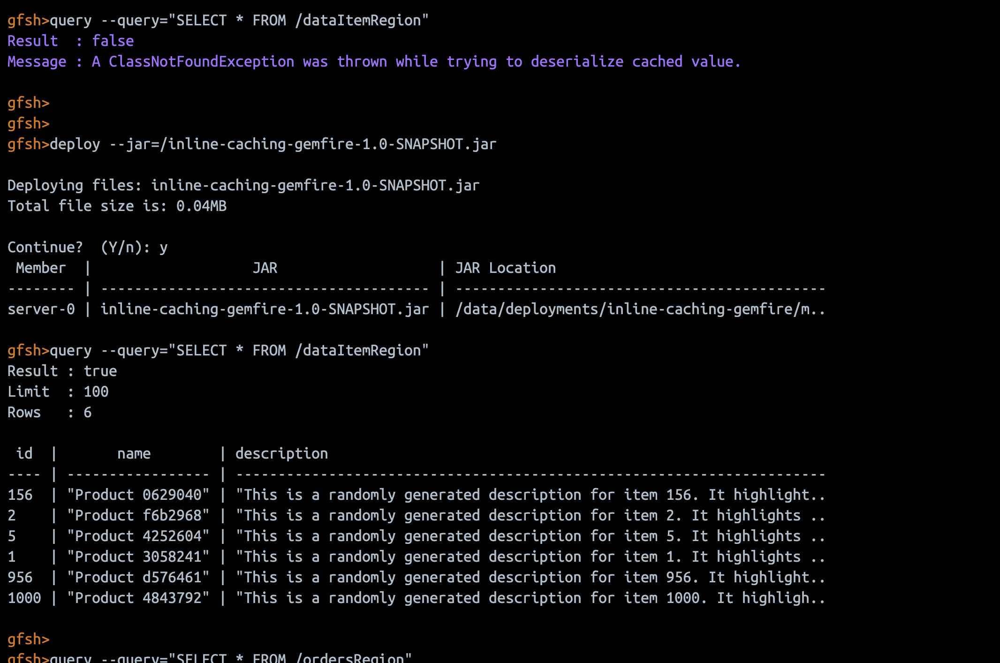

# GemFire shopping with inline caching with Postgres

This project demonstrates the implementation of inline caching using Apache Geode (GemFire) in a Spring Boot application. The goal is to improve application performance by caching frequently accessed data in memory, reducing the need for repeated database queries and exposes a shopping experiece levergaing the data cached in gemfire.


## Features

- **Inline Caching**: Utilizes GemFire to cache frequently accessed data, improving performance and reducing database load.
- **Spring Boot Integration**: Fully integrated with Spring Boot for easy setup and configuration.
- **RESTful API**: Provides a simple RESTful API to interact with the cached data.
- **Vaadin UI**: Provides a user-friendly interface
- **Shopping UI**: Provides a user-friendly interface for browsing products,

## Data Model

The application uses a simple table in PostgreSQL:

**Table: `data_item`**
| Column      | Type    | Description         |
|-------------|---------|---------------------|
| id          | BIGINT  | Primary key         |
| name        | TEXT    | Name of the item    |
| description | TEXT    | Description         |

The corresponding Java model is `com.example.model.DataItem`.

## Getting Started

### Prerequisites

- Java 21
- Maven
- PostgreSQL (with a `data_item` table and sample data)
- Gemfire up and running [https://gemfire.dev/quickstart/docker](https://gemfire.dev/quickstart/docker)


Add Spring Boot for VMware GemFire to a Project
The Spring Boot for VMware GemFire dependencies are available from the Broadcom Support Portal. Access to the Broadcom Maven Repository requires a one-time registration step to create an account.

Spring Boot for VMware GemFire requires users to add the GemFire repository to their projects.

To add Spring Boot for VMware GemFire to a project:

1. You will need a [Broadcom Support Portal](https://support.broadcom.com/) account.

2. Select My Downloads. Search by Product Name = VMware Tanzu GemFire. Click on VMware Tanzu GemFire. Click on VMware Tanzu GemFire. Scroll down, Show All Releases, scroll down to Click Green Token for Repository Access and click on the green symbol to the far right. Note your email address. Copy your access_token (not including any surrounding quotation marks).

3. Add the GemFire repository to your project:
 
Maven: Add the following block to the pom.xml file:
```
<repository>
    <id>gemfire-release-repo</id>
    <name>Broadcom GemFire Release Repository</name>
    <url>https://packages.broadcom.com/artifactory/gemfire/</url>
</repository>
```
4. Add your Broadcom Maven Repository credentials.
Maven: Add the following to the **.m2/settings.xml** file. Replace MY-USERNAME@example and MY-ACCESS-TOKEN with your Broadcom Maven Repository credentials.

```
<settings>
    <servers>
        <server>
            <id>gemfire-release-repo</id>
            <username>MY-USERNAME@example.com</username>
            <password>MY-ACCESS-TOKEN</password>
        </server>
    </servers>
</settings>
```

5. After you have set up the repository and credentials, add the Spring Boot for VMware GemFire dependency to your application.


### Installation

#### Postgres setup

```
docker run  -d --name postgres -p 5432:5432 -e POSTGRES_USER=postgres -e POSTGRES_PASSWORD=postgres debezium/example-postgres:2.3.3.Final
```

#### Create table and Sample Data

```
CREATE TABLE data_item (
    id SERIAL PRIMARY KEY, -- 'id' will automatically generate unique, sequential integers
    name VARCHAR(255) NOT NULL,
    description TEXT
);


INSERT INTO data_item (id, name, description)
SELECT
    -- Dynamically calculate the starting ID based on the current MAX(id) in the table
    -- COALESCE handles the case where the table is empty (MAX(id) would be NULL)
    COALESCE((SELECT MAX(id) FROM data_item), 0) + gs.i,
    'Product ' || SUBSTRING(MD5(RANDOM()::TEXT) FROM 1 FOR 3) || FLOOR(RANDOM() * 9000 + 1000)::TEXT,
    'This is a randomly generated description for item ' || gs.i || '. It highlights various attributes and features, such as ' ||
    CASE FLOOR(RANDOM() * 3)
        WHEN 0 THEN 'durability'
        WHEN 1 THEN 'efficiency'
        ELSE 'ease of use'
    END ||
    ', and is ideal for ' ||
    CASE FLOOR(RANDOM() * 4)
        WHEN 0 THEN 'home users.'
        WHEN 1 THEN 'professional environments.'
        WHEN 2 THEN 'outdoor adventures.'
        ELSE 'everyday tasks.'
    END ||
    ' Additional unique identifier: ' || MD5(RANDOM()::TEXT)
FROM generate_series(1, 1000) as gs(i);
```


1. Clone the repository:

   ```
   git clone https://github.com/yourusername/inline-caching-gemfire.git
   cd inline-caching-gemfire
   ```

2. Build the project using Maven:

   ```
   mvn clean install
   ```

## Deploy to production

```
mvn clean package -Pproduction -Dvaadin.force.production.build=true
```

```
 jar tvf target/inline-caching-gemfire-1.0-SNAPSHOT.jar | grep META-INF/VAADIN/
```

3. Configure your database connection in `src/main/resources/application.properties`:

   ```
   spring.datasource.url=jdbc:postgresql://localhost:5432/yourdb
   spring.datasource.username=youruser
   spring.datasource.password=yourpassword
   ```

4. **Start the GemFire server and create the region:**

   - Start a GemFire locator and server:

   - gemfire up and running [https://gemfire.dev/quickstart/docker](https://gemfire.dev/quickstart/docker)

   - Create the region for caching:
     ```
     create region --name=dataItemRegion --type=PARTITION
     ```

5. Run the Spring Boot application:
   ```
   mvn spring-boot:run
   ```

### Usage

- Access the application at `http://localhost:8080`.
- Use the REST endpoint to fetch data by ID:
  ```
  GET http://localhost:8080/data/{id}
  ```
  - On first request, data is loaded from PostgreSQL and cached in GemFire.
  - Subsequent requests for the same ID are served from the cache.

### Testing the Cache

1. **Insert sample data into PostgreSQL:**
   ```sql
   INSERT INTO data_item (id, name, description) VALUES (1, 'Widget', 'A useful widget');
   ```

2. **Test cache behavior:**
   - Make a GET request:
     ```
     curl http://localhost:8080/data/1
     ```
     - The first call fetches from the database and caches the result.
     - Subsequent calls fetch directly from GemFire (no database hit).


3. **To verify caching:**
   - Enable SQL logging in `application.properties`:
     ```
     spring.jpa.show-sql=true
     ```
   - Observe that only the first request triggers a SQL query.

4. **Example curl commands to test the API:**

   - Fetch data with ID 1 (first call, loads from DB and caches):
     ```
     curl -i http://localhost:9989/data/1
     ```

   - Fetch the same data again (should be served from cache, no DB hit):
     ```
     curl -i http://localhost:9989/data/1
     ```

   - Fetch data with a different ID (replace `2` with your actual data):
     ```
     curl -i http://localhost:9989/data/2
     ```

   - You can observe the difference in SQL logs between the first and subsequent requests.


```
http://localhost:9989/
```

```
http://localhost:9989/products
```


```
gfsh>configure pdx --read-serialized=true
```


```
destroy region --name=productsRegion
```

```
create region --name=productsRegion --type=PARTITION
```

```
create region --name=ordersRegion --type=PARTITION

```

### Loading a JAR to GemFire

```
% jar tf /Users/avannala/Documents/workspace/inline-caching-gemfire/target/inline-caching-gemfire-1.0-SNAPSHOT.jar | grep Product
com/example/ui/ProductView.class
com/example/repository/ProductRepository.class
com/example/model/ProductFetchResult.class
com/example/model/Product.class
com/example/service/ProductService.class
```

```
% docker cp /Users/avannala/Documents/workspace/inline-caching-gemfire/target/inline-caching-gemfire-1.0-SNAPSHOT.jar d90c43c7f804:/inline-caching-gemfire-1.0-SNAPSHOT.jar
Successfully copied 27.1kB to d90c43c7f804:/inline-caching-gemfire-1.0-SNAPSHOT.jar

```

```
gfsh>deploy --jar=/inline-caching-gemfire-1.0-SNAPSHOT.jar

Deploying files: inline-caching-gemfire-1.0-SNAPSHOT.jar
Total file size is: 0.04MB

Continue?  (Y/n): y
 Member  |                   JAR                   | JAR Location
-------- | --------------------------------------- | ---------------------------------------------------------------------
server-0 | inline-caching-gemfire-1.0-SNAPSHOT.jar | /data/deployments/inline-caching-gemfire/main/lib/inline-caching-ge..

gfsh>

```

```
gfsh>query --query="SELECT * FROM /dataItemRegion"
Result : true
Limit  : 100
Rows   : 6

 id  |       name        | description
---- | ----------------- | ----------------------------------------------------------------------
156  | "Product 0629040" | "This is a randomly generated description for item 156. It highlight..
2    | "Product f6b2968" | "This is a randomly generated description for item 2. It highlights ..
5    | "Product 4252604" | "This is a randomly generated description for item 5. It highlights ..
1    | "Product 3058241" | "This is a randomly generated description for item 1. It highlights ..
956  | "Product d576461" | "This is a randomly generated description for item 956. It highlight..
1000 | "Product 4843792" | "This is a randomly generated description for item 1000. It highligh..

```




```
# Add to cart and save cookies
curl -c cookies.txt -X POST "http://localhost:9989/api/cart/add/10097"

# View cart using the same cookies (same session)
curl -b cookies.txt "http://localhost:9989/api/cart"


curl -b cookies.txt -X DELETE "http://localhost:9989/api/cart/remove/10097"


curl -b cookies.txt  -X POST "http://localhost:9989/api/checkout" \
  -d "name=John Doe" \
  -d "shippingAddress=123 Main St" \
  -d "billingAddress=456 Elm St"
```

### 💡 How Inline Caching Works in this Project
This project implements a cache-aside pattern, which is a common strategy for inline caching.

- Client Request: A request comes into the Spring Boot application (e.g., GET /data/{id}).

- Cache Lookup: The application's service layer first checks if the DataItem with the requested id is present in the dataItemRegion in GemFire.

- Cache Hit: If the item is found in GemFire (a "cache hit"), it's immediately returned to the client. This is extremely fast!

- Cache Miss: If the item is not found in GemFire (a "cache miss"), the application then queries PostgreSQL to fetch the DataItem.

- Cache Population: Once the DataItem is retrieved from PostgreSQL, it's immediately stored in the dataItemRegion in GemFire.

- Return Data: The DataItem is then returned to the client. Subsequent requests for the same id will now result in a cache hit.

This intelligent flow ensures that your database is only queried when necessary, reducing load and improving responsiveness.


### GemFire Setup Notes

- Ensure GemFire server is running and the `dataItemRegion` region is created before starting the Spring Boot app.
- The region type should be `PARTITION` or `REPLICATE` as needed.
- The application connects as a GemFire client and uses the region for caching.


## Shopping API Endpoints

The following endpoints are exposed by the application for shopping, cart, and product management. All endpoints are prefixed with `/api` unless otherwise noted.

### Product Endpoints

- **List all cached products**
  - **GET** `/api/listproducts`
  - Returns all products currently in the GemFire cache.
  - Example:
    ```
    curl http://localhost:9989/api/listproducts
    ```

- **Fetch N products (loads from DB if not cached)**
  - **GET** `/products`
  - Use the Vaadin UI at [http://localhost:9989/products](http://localhost:9989/products) to fetch and view products.

### Cart Endpoints

- **View cart**
  - **GET** `/api/cart`
  - Returns all products in the current user's cart.
  - Example:
    ```
    curl -b cookies.txt http://localhost:9989/api/cart
    ```

- **Add product to cart**
  - **POST** `/api/cart/add/{prodId}`
  - Adds the product with the given ID to the cart.
  - Example:
    ```
    curl -c cookies.txt -X POST "http://localhost:9989/api/cart/add/10097"
    ```

- **Remove product from cart**
  - **DELETE** `/api/cart/remove/{prodId}`
  - Removes the product with the given ID from the cart.
  - Example:
    ```
    curl -b cookies.txt -X DELETE "http://localhost:9989/api/cart/remove/10097"
    ```

- **Clear cart**
  - **DELETE** `/api/cart/clear`
  - Removes all products from the cart.
  - Example:
    ```
    curl -b cookies.txt -X DELETE "http://localhost:9989/api/cart/clear"
    ```

### Checkout Endpoint

- **Checkout**
  - **POST** `/api/checkout`
  - Completes the purchase for all items in the cart. Requires user info.
  - Example:
    ```
    curl -b cookies.txt -X POST "http://localhost:9989/api/checkout" \
      -d "name=John Doe" \
      -d "shippingAddress=123 Main St" \
      -d "billingAddress=456 Elm St"
    ```

---

## Vaadin UI

- **Product Browser:** [http://localhost:9989/products](http://localhost:9989/products)
- **Product List (all cached):** [http://localhost:9989/listproducts](http://localhost:9989/listproducts)
- **Cart:** [http://localhost:9989/cart](http://localhost:9989/cart)
- **Checkout:** [http://localhost:9989/checkout](http://localhost:9989/checkout)

---

## Notes

- Use the `-c cookies.txt` and `-b cookies.txt` options with `curl` to maintain session (cart is session-scoped).
- The `/api/listproducts` endpoint only shows products currently in the GemFire cache.
- Use the Vaadin UI to browse, add to cart, and checkout interactively.


<!-- 
INFO]
[INFO] -----------------< com.example:inline-caching-gemfire >-----------------
[INFO] Building Inline Caching with GemFire 1.0-SNAPSHOT
[INFO] --------------------------------[ jar ]---------------------------------
Downloading from central: https://repo.maven.apache.org/maven2/com/vaadin/vaadin-maven-plugin/24.7.6/vaadin-maven-plugin-24.7.6.pom
Downloaded from central: https://repo.maven.apache.org/maven2/com/vaadin/vaadin-maven-plugin/24.7.6/vaadin-maven-plugin-24.7.6.pom (5.2 kB at 8.8 kB/s)
Downloading from central: https://repo.maven.apache.org/maven2/com/vaadin/vaadin-maven-plugin/24.7.6/vaadin-maven-plugin-24.7.6.jar
Downloaded from central: https://repo.maven.apache.org/maven2/com/vaadin/vaadin-maven-plugin/24.7.6/vaadin-maven-plugin-24.7.6.jar (30 kB at 177 kB/s)
Downloading from gemfire-release-repo: https://packages.broadcom.com/artifactory/gemfire/com/vmware/gemfire/gemfire-core/10.0.0/gemfire-core-10.0.0.pom
Downloading from gemfire-release-repo: https://packages.broadcom.com/artifactory/gemfire/com/vmware/gemfire/gemfire-cq/10.0.0/gemfire-cq-10.0.0.pom
[INFO] ------------------------------------------------------------------------
[INFO] BUILD FAILURE
[INFO] ------------------------------------------------------------------------
[INFO] Total time:  2.767 s
[INFO] Finished at: 2025-06-17T21:20:51Z
[INFO] ------------------------------------------------------------------------
[ERROR] Failed to execute goal on project inline-caching-gemfire: Could not resolve dependencies for project com.example:inline-caching-gemfire:jar:1.0-SNAPSHOT: Failed to collect dependencies at com.vmware.gemfire:gemfire-core:jar:10.0.0: Failed to read artifact descriptor for com.vmware.gemfire:gemfire-core:jar:10.0.0: Could not transfer artifact com.vmware.gemfire:gemfire-core:pom:10.0.0 from/to gemfire-release-repo (https://packages.broadcom.com/artifactory/gemfire/): Authentication failed for https://packages.broadcom.com/artifactory/gemfire/com/vmware/gemfire/gemfire-core/10.0.0/gemfire-core-10.0.0.pom 401 Unauthorized -> [Help 1]
[ERROR]
[ERROR] To see the full stack trace of the errors, re-run Maven with the -e switch.
[ERROR] Re-run Maven using the -X switch to enable full debug logging.
[ERROR]
[ERROR] For more information about the errors and possible solutions, please read the following articles:
[ERROR] [Help 1] http://cwiki.apache.org/confluence/display/MAVEN/DependencyResolutionException
ubuntu@harbor:~/gemfire-spring-shopping$ ls -a
.  ..  blog.md	.git  .github  .gitignore  loadtest.sh	.m2  manifest.yaml  pom.xml  README.md	src  target  .vscode
ubuntu@harbor:~/gemfire-spring-shopping$ -->